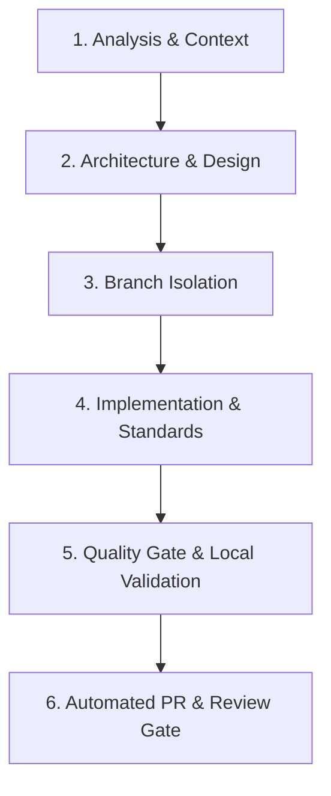

# Git & PR Workflow Skill

Follow this workflow for all code, content, and configuration modifications.

## 6-Stage Development Lifecycle



---

### Stage 1: Analysis & Context
- Ingest DOM structure, CSS inheritance, JSON-LD schemas, and existing assets.
- Identify affected navigation targets (`#hero`, `#about`, `#moderation`, `#kontakt`), canonical tags, or legal subpages.

### Stage 2: Architecture & Design
- Verify changes adhere strictly to pure Vanilla JS (ES6+) and Bootstrap 5 without external dependencies.
- Ensure CSS additions reside exclusively in `css/katrin.css` respecting cascade specificity.
- Plan SEO, Open Graph, and Schema.org metadata updates.

### Stage 3: Branch Isolation
- **Never commit directly to `master`.**
- Create and switch to a descriptive branch from latest `master`:
  - `feature/<short-description>`: New sections, features, or content.
  - `fix/<short-description>`: Bugfixes, broken anchors, or layout adjustments.
  - `chore/<short-description>`: Maintenance, CI/CD, agent configs, or dependencies.
  ```bash
  git checkout -b <branch-name>
  ```

### Stage 4: Implementation & Standards
- Implement clean, semantic HTML5 and Vanilla JS logic.
- Ensure all image tags specify explicit dimensions (`width`, `height`) and modern formats (`.webp`).
- Update `sitemap.xml` with current `<lastmod>` timestamp whenever pages change.
- **Fast Inner Loop:** Validate continuously during active editing:
  ```bash
  ./test.sh --fast
  ```

### Stage 5: Quality Gate & Local Validation
- Run the full regression test suite before staging changes:
  ```bash
  ./test.sh
  ```
- Confirm **0 errors** across all static checks and 25 live HTTP endpoints.

### Stage 6: Automated PR & Review Gate
1. **Selective Git Staging:** Never run `git add .` blindly. Stage only modified files:
   ```bash
   git add <file1> <file2>
   ```
2. **Imperative Commit Message:**
   ```bash
   git commit -m "<type>: <concise description>"
   ```
   *Types: `feat:`, `fix:`, `chore:`, `docs:`.*
3. **Push to Origin:**
   ```bash
   git push -u origin <branch-name>
   ```
4. **Create Pull Request via GitHub CLI:**
   ```bash
   gh pr create --base master --head <branch-name> --title "<title>" --body "## Summary of Changes
   - <bullet point changes>

   ## Core Web Vitals & Technical Quality Checklist
   - [x] **LCP / Image Optimization:** Verified via test suite.
   - [x] **No CLS:** Responsive layout and dimension rules verified.
   - [x] **JavaScript:** Pure Vanilla JS confirmed.
   - [x] **Structured Data:** Valid JSON-LD Schema.org markup confirmed.
   - [x] **Accessibility (a11y):** ARIA and external link attributes confirmed.
   - [x] **Automated Test Run:** Local validation executed and passed (\`./test.sh\`)."
   ```
5. CI (`ci.yml`) runs automated validation on the PR. Merging to `master` triggers production deployment (`deploy.yml`).
