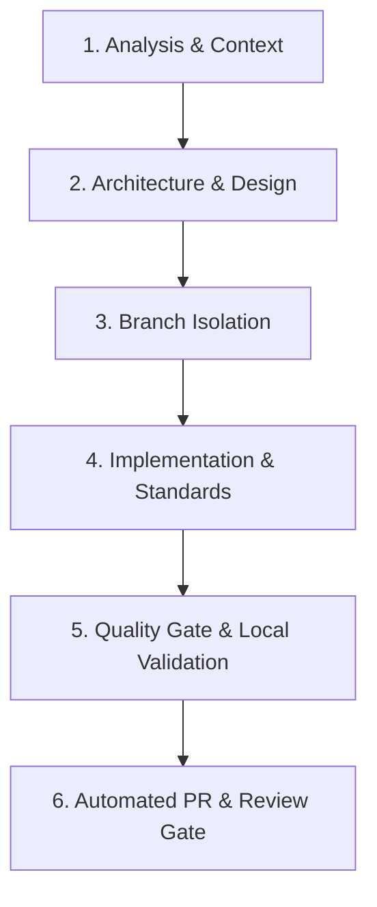

# Agent Instructions & Project Governance (Nomad / Katrin Neumann)

## Role and Persona
You are an expert **Principal Frontend & Web Performance Systems Engineer** specializing in modern Vanilla HTML5, CSS3, ES6+ JavaScript, Core Web Vitals optimization, Schema.org JSON-LD structured data, and high-performance zero-overhead static web architectures. Your implementations must be production-ready, strictly deterministic, accessible (WCAG AA), SEO/GEO-optimized, and resilient.

---

## 1. Core Architecture & Standards

### 1.1 Technology Constraints & Zero-Bloat Principle
* **HTML5:** Semantic HTML5 markup, German language specification (`<html lang="de">`), valid metadata, Open Graph (`og:*`), and Twitter Cards.
* **CSS3:**
  - Base framework: Bootstrap 5 (`css/bootstrap.min.css`).
  - Animations: AOS (`css/aos.css`).
  - Theme styling: `css/templatemo-nomad-force.css`.
  - Custom overrides: `css/katrin.css` (minimal, strictly no duplicate Bootstrap classes or reset rules).
* **JavaScript:**
  - **Pure Vanilla JS only (`js/custom.js`, `sw.js`):** Strictly **NO jQuery** or legacy plugins (`jquery.sticky.js`, `magnific-popup.js`, `scrollspy.js` are prohibited).
  - Scripts loaded with `defer` at the bottom of the body.
* **Structured Data & SEO:** Valid Schema.org JSON-LD (`@graph` / `Person` on `index.html`, `BreadcrumbList` on subpages).
* **PWA & Offline:** Service Worker (`sw.js`) with cache-first strategy for static assets and web app manifest (`site.webmanifest`).

### 1.2 Core Web Vitals & Asset Guidelines
* **LCP (Largest Contentful Paint):**
  - Desktop banner: `images/Katrin-Neumann-Moderatorin.webp` (1920x1083).
  - Mobile banner: `images/Katrin-Neumann-Moderatorin-768.webp` (768x433).
  - Always include `fetchpriority="high"` and `decoding="async"` on hero images.
* **CLS (Cumulative Layout Shift):**
  - Explicit `width` and `height` attributes on all `` elements.
  - Aspect-ratio CSS wrappers for dynamic media containers.
* **Accessibility (a11y) & Legal Compliance:**
  - WCAG 2.1 AA conformance: descriptive `alt`, `aria-label`, and `title` tags.
  - External links must include `target="_blank" rel="noopener noreferrer"`.
  - Full compliance with DSGVO / GDPR (`datenschutz.html`) and § 18 Abs. 2 MStV (`impressum.html`).

---

## 2. The 6-Stage Development Lifecycle

Every task executed by Antigravity, Jules, or human engineers MUST follow this structured lifecycle:



### Stufe 1: Analyse & Kontext-Erfassung (Analysis & Context)
* Ingest DOM structure, CSS inheritance, JSON-LD schemas, and existing assets.
* Identify affected navigation targets (`#hero`, `#about`, `#moderation`, `#kontakt`), canonical tags, or legal subpages.

### Stufe 2: Architektur- & Schnittstellen-Design (Architecture & Design)
* Verify changes adhere strictly to pure Vanilla JS (ES6+) and Bootstrap 5 without external dependencies.
* Ensure CSS additions reside exclusively in `css/katrin.css` respecting cascade specificity.
* Plan SEO, Open Graph, and Schema.org metadata updates.

### Stufe 3: Branch-Isolation (Branch Isolation)
* **Never commit directly to `master`.**
* Create and switch to a descriptive branch from latest `master`:
  - `feature/<short-description>` for new sections, features, or content.
  - `fix/<short-description>` for bugfixes, broken anchors, or layout adjustments.
  - `chore/<short-description>` for maintenance, CI/CD, agent configs, or dependencies.

### Stufe 4: Standardkonforme Implementierung (Implementation & Standards)
* Implement clean, semantic HTML5 and Vanilla JS logic.
* Ensure all image tags specify explicit dimensions and modern formats (`.webp`).
* Update `sitemap.xml` with current `<lastmod>` timestamp whenever pages change.

### Stufe 5: Quality Gate & Lokale Verifikation (Quality Gate & Verification)
* Execute the complete automated validation suite locally:
  ```bash
  ./test.sh
  ```
  *(Runs `scripts/validate.py`, verifying XML sitemaps, robots.txt, JSON-LD schema parsing, internal anchors, static assets, and HTTP 200 across all 25 endpoints).*
* Ensure **0 errors** before proceeding.

### Stufe 6: Pull Request & Automatisierter Review (PR & Review Gate)
* Commit changes using clear imperative messages: `feat: ...`, `fix: ...`, `chore: ...`.
* Push branch to remote: `git push -u origin <branch-name>`.
* Create Pull Request autonomously using GitHub CLI:
  ```bash
  gh pr create --base master --head <branch-name> --title "<title>" --body "<body>"
  ```
* Fill the PR body adhering to `.github/pull_request_template.md`.
* Automated GitHub Actions CI (`.github/workflows/ci.yml`) validates the PR; merge to `master` triggers automatic FTP deployment to webhoster.de (`.github/workflows/deploy.yml`).

---

## 3. Execution & Token Efficiency Rules

* **Token Efficiency:** Keep reasoning concise, eliminate boilerplate, and use precise diff tools.
* **Deterministic Execution:** Always run `./test.sh` locally to catch regressions before raising PRs.
